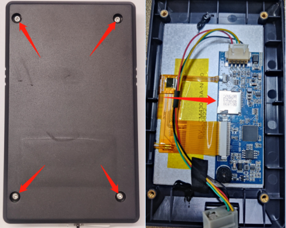
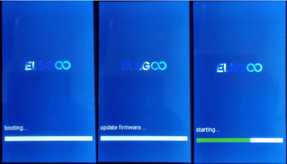
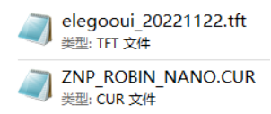
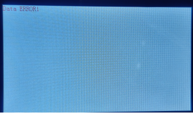
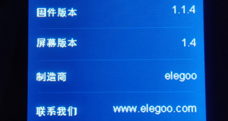

- Reminder: This page is constantly being updated, information may be missing or inaccurate. Please stay tuned, thank you!

---
# **_Neptune3Pro/Plus/Max Firmware Update Instructions_**

### Firmware Version Compatibility:
| Screen Version | Mainboard Version       | Description         |
|----------------|-------------------------|---------------------|
| 1.4 - V1.4.1   |      1.x.4 - 1.x.5.1a   | Historical version  |
| V1.4.2         |      1.x.5.1b           | Release version     |
| 1.5-Beta       |      1.x.5.2 - 1.x.5.3a | Beta version        |

[Update log](https://github.com/NARUTOfzr/Neptune_3_Pro_Plus_Max/blob/main/Update%20log.md)

---
### File Description:
| Firmware Naming |                        |
|-----------------|------------------------|
| xxxxxxxx.tft    | Screen firmware        |
| xxxxxxxx.bin    | Mainboard firmware     |

---
### Update Instructions:
1. Format the TF card as shown in the figure.    
   Requirements: File system (F): `FAT32`    
      

2. Copy the above two firmware files to the root directory of TF card as shown in the picture.    
      

---
### Screen firmware update steps:
1. Loosen the screws, remove the screen back cover; note the direction of card insertion, insert the TF card.    
  

2. Restart the machine and wait for the firmware to finish loading. The firmware loading process and the completed interface is shown in the figure, just remove the TF card and restart the machine after loading is complete. (Screen firmware update takes about 60 seconds)    

---
### Mainboard firmware update steps:
Insert TF card into the machine, then restart the machine and wait for the firmware to finish loading; the screen display during the firmware loading process is shown in the figure, the firmware update will go directly to the main interface after completion.    
(Motherboard firmware takes about 15 seconds. If you can't enter the main interface for a long time, format the TF card to reload the firmware.)    

---  
# **_`FAQ：`_** 
1. Screen firmware and motherboard firmware compatibility   
Neptune3Pro/Plus/Max screen firmware is the same, the motherboard firmware is also using the same source code, please update the corresponding firmware file according to your machine model.   
Motherboard firmware naming scheme:   
Neptune3Pro：1.1.x.x    
Neptune3Plus: 1.2.x.x   
Neptune3Max: 1.3.x.x    
Please check [Update Log](https://github.com/NARUTOfzr/Neptune_3_Pro_Plus_Max/blob/main/Update%20log.md) for the compatibility and updates between different versions of screen firmware and motherboard firmware.

2. After starting the machine the interface will display "Update firmware ..." as shown in the picture.   
    
Cause: After starting the power supply for a period of time and the display does not receive a signal from the motherboard, it will jump to that interface until it receives a signal from the motherboard to start.    
Root cause and solution:

:point_right: 1) It may be a bug in the historical firmware, it is recommended to check and update the motherboard firmware to `1.x.5.1a`.    

:point_right: 2) It may be a bad contact between the motherboard and the display connection cable (signal cable contact is poor), it is recommended to plug the connection cable tighter before rebooting.

3. Screen firmware will not be renamed after loading and can be loaded repeatedly, so you must remove the TF card after updating the screen firmware; the motherboard firmware will be renamed to `"ZNP_ROBIN_NANO.CUR"` after successful loading, you can rename the suffix and load it again.   

4. If you disconnect the power or remove the TF card without waiting for the screen firmware to finish loading, you will not be able to enter the main interface after rebooting the machine normally, and the display will be as follows:  

5. You can check the UI and motherboard firmware version in [Settings] → [Information].  

6. After reloading the motherboard firmware, the leveling value will be cleared to zero and the machine must be leveled again.    

7. The screen after the recovery of power loss will lead to some information loss (such as firmware version number loss, thumbnails in the print does not show), is a normal phenomenon and will not affect the normal printing. After rebooting the machine, the data will be displayed again.   

8. As shown in the figure, when upgrading the screen firmware it can show 'multiple `TFT` files' and then goes directly to the main screen.    
  
Reason: Some MacBooks with the macOS system will generate  prefix file with the same name, which cannot be viewed on the MacBook, but can be viewed on other systems, which is the main reason for the failure of updating screen firmware. As shown in the image:    
     
The solution for MacBook users to remove the files with the  prefix:    
:point_right: 1) Move the desired file to a USB flash drive. :point_right: 2) Open "Terminal".  :point_right: 3) Type `dot_clean` followed by a space, and then drag the USB flash drive icon into the terminal. :point_right: 4) Press enter and eject the USB flash drive. Files with the  prefix are now deleted.       
The solution is shown in the video: [bilibili video tutorial](https://www.bilibili.com/video/BV1Lv4y1C7Qz/?share_source=copy_web&vd_source=39af2b2e9e60f33607226e91f3f17001) [YouTube video tutorial](https://youtu.be/mdb4PTPlJh4)

9. The error in the figure is displayed when upgrading the screen firmware.   
  
Cause: The screen firmware file is corrupted.     
Solution:    
     :point_right: 1) Format the TF card.    
     :point_right: 2) Re-download the file or contact the after-sales service to get the screen firmware file to update the firmware again.    
     :point_right: 3) Try to use the processing method in question 8 to deal with it.
